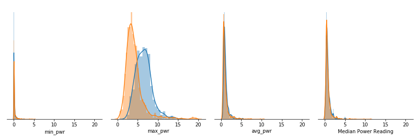

# Abstract

# Introduction

### Background
Increasing electric vehicle (EV) ownership presents new challenges for the energy grid. Potential impacts include infrastructure failure, unstable electricity streams and power outages. Highest risk areas are those whose peak demands are already approaching maximum capacity. Fortunately, the steadily increasing adoption of EVs provides an opportunity to proactively address problems and optimize solutions. With XXXXX and emerging technologies, EV growth delivers an opportunity to improve our energy infrastructure.  

Predictive modeling plays a critical role in optimizing supply, managing demand and coordinating consumption. Introducing a fleet of EV batteries effectively increases the grid's storage capacity. The ability to store energy creates separation between energy supply and demand, buffering against unexpected fluctuations. Properly managed, the decentralization of energy storage may improve overall energy market stability. Maximizing EV charging during low-demand times and minimizing during high demand times would promote smoothing. Furthermore, EV batteris may enable more efficient use of "clean" energy sources which are transient and don't necessarily align with the current demand cycles. The ability to predict when and where EVs are plugging in is critical to optimizing the energy grid for both environmental impact and consumer demand.
÷'/

### Problem Description
The training set contains two months of smart meter power readings from 1590 houses. The readings were taken at half-hour intervals. Some of the homes have electric vehicles and some do not. The file "EV_train_labels.csv" indicates the time intervals on which an electric vehicle was charging (1 indicates a vehicle was charging at some point during the interval and 0 indicates no vehicle was charging at any point during the interval). Can you determine:  

  A. Which residences have electric vehicles?  
  B. When the electric vehicles were charging?  
  C. Any other interesting aspects of the dataset?  

A solution to part B might consist of a prediction of the probability that an electric car was charging for each house and time interval in the test set. Please include code and explain your reasoning. What do you expect the accuracy of your predictions to be?

# Body

### Data Section - Include written descriptions of data and follow with relevant spreadsheets.
The training data contains 60 days of power readings for 1590 houses. Of the 1590 houses, 30.5% or 485 houses, charged an EV at least once during the 60-day window.  

The training data has an imbalanced distribution between classes. After removing outliers, 2.4% of all power readings occurred during EV charging. This increased to 7.7% when only considering the power readings from households with EVs. In both cases, the proportion of EV charging events is significantly lower that the non-EV charging events. This imbalance likely mimics realistic data. Therefore, the model's bias may not be concerning. The imbalance could be reduced or eliminated by removing power readings from the non-EV class. I chose not to balance the data because (1) I wanted the training data to mimic a realistic data distribution and (2) it would significantly reducing the size of the training data set. 

TODO: Insert figure summarizing imbalanced data

### Methods Section - Explain how you gathered and analyzed data.

**Data Preparation**  
Initial investigation revealed outliers in the direction of the maximum power readings. Houses with maximum readings in the top 5% (> 2 stds) were removed from the dataset. This resulted in the disqualification of 37 houses (2.3%). To avoid creating holes in the data, the entire house was removed, instead of a single house-interval data point.  

Prior to training, the data was normalized using the sk-learn StandardScaler. TODO: Discuss more about this normalization.

**Model Selection**  
Both objectives can be addressed with binary classification models. After comparing several models, logistic regression was selected for both 

TODO: Compare different models 
https://www.kaggle.com/klaudiajankowska/binary-classification-methods-comparison
Logistic Regression
Decision Tree
Support Vector Machine
Linear Discriminant Analysis
Quadratic Discriminant Analysis
Random Forest
K-Nearest Neighbors
Naive Bayes

**Classification Chain**  

### Analysis Section - Explain what you analyzed. Include any charts here.

### Results - Describe the results of your analysis.

# Conclusion

* Restate the questions from your introduction.
* Restate important results.
* Include any recommendations for additional data as needed.

### Future work
Additional data
* Datetime stamps instead of intervals
  - traditional energy consumption is closely related to time of day
  - week day likely impacts grid patterns

* Location data, such as zip codes.
  - Affluence
  - regional EV ownership
  - weather patterns

Resolve Data Ambiguities
  - Does "charge" mean plugged in or actively charging? 
  - Are the power readings a single time point, or cumulative over the interval?

Model Optimization 
  - Compare alternative ML methods. 
  - Optimize model parameters   
  - Further Outlier Removal