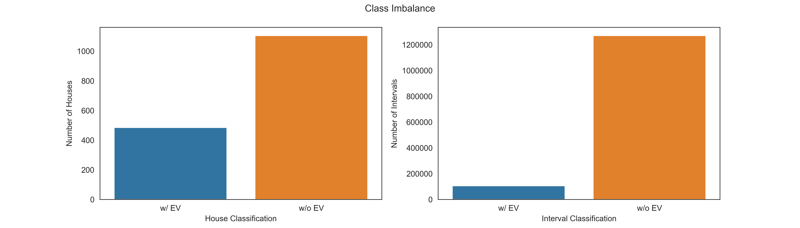
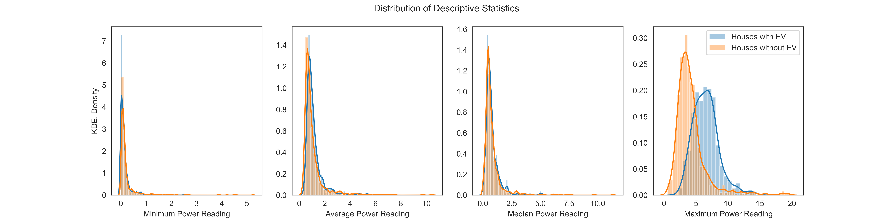
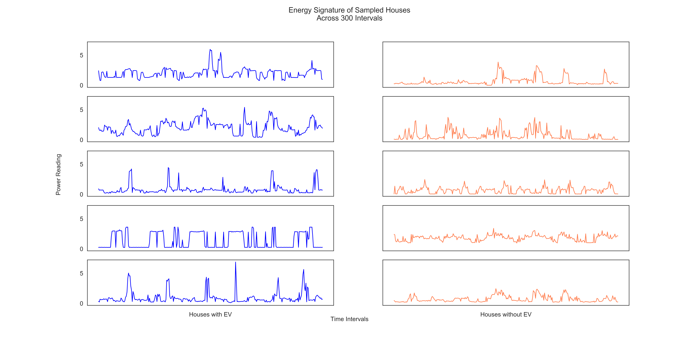

# Abstract

# Introduction

### Background
Increasing electric vehicle (EV) ownership presents new challenges for the energy grid. Potential impacts include infrastructure failure, unstable electricity streams and power outages. Highest risk areas are those whose peak demands are already approaching maximum capacity. Fortunately, the steadily increasing adoption of EVs provides an opportunity to proactively address problems and optimize solutions. With XXXXX and emerging technologies, EV growth delivers an opportunity to improve our energy infrastructure.  

Predictive modeling plays a critical role in optimizing supply, managing demand and coordinating consumption. Introducing a fleet of EV batteries effectively increases the grid's storage capacity. The ability to store energy creates separation between energy supply and demand, buffering against unexpected fluctuations. Properly managed, the decentralization of energy storage may improve overall energy market stability. Maximizing EV charging during low-demand times and minimizing during high demand times would promote smoothing. Furthermore, EV batteris may enable more efficient use of "clean" energy sources which are transient and don't necessarily align with the current demand cycles. The ability to predict when and where EVs are plugging in is critical to optimizing the energy grid for both environmental impact and consumer demand.

### Problem Description
The training set contains two months of smart meter power readings from 1590 houses. The readings were taken at half-hour intervals. Some of the homes have electric vehicles and some do not. The file "EV_train_labels.csv" indicates the time intervals on which an electric vehicle was charging (1 indicates a vehicle was charging at some point during the interval and 0 indicates no vehicle was charging at any point during the interval). Can you determine:  

  A. Which residences have electric vehicles?  
  B. When the electric vehicles were charging?  
  C. Any other interesting aspects of the dataset?  

A solution to part B might consist of a prediction of the probability that an electric car was charging for each house and time interval in the test set. Please include code and explain your reasoning. What do you expect the accuracy of your predictions to be?

# Project Details  

## Data Profiling  

The training data contains 60 days of power readings for 1590 houses. Of the 1590 houses, 30.5% or 485 houses, charged an EV during at least one interval in the time period. 

The training data has an imbalanced class distribution. After removing outliers, 2.4% of all power readings occurred during EV charging. This increased to 7.7% when only considering the power readings from households with EVs. In both cases, the proportion of EV charging events is significantly lower that the non-EV charging events. The imbalance could be reduced or eliminated by removing power readings from the non-EV class. I chose not to balance the data because (1) I wanted the training data to mimic a realistic data distribution and (2) it would significantly reducing the size of the training data set. As a result, the models developed are biased towards non-EV charging events. 

## Methods
### Data Preparation  
Initial investigation revealed outliers with exceptionally large power readings. To account for this, houses with any power readings in the top 5% (> 2 stds) were removed from the dataset. This resulted in the disqualification of 37 houses (2.3%). To avoid creating holes in the data, the entire house was removed, instead of a single house-interval data point.  

Descriptive Statistics before Removing Outliers  

|       | Total Power | Average Power | Median Power | Min Power | Max Power | Total Charges |
|-------|-------------|---------------|--------------|-----------|-----------|---------------|
| mean  | 4031.3      | 1.4           | 1.1          | 0.3       | 5.7       | 67.2          |
| std   | 8921.2      | 3.1           | 2.8          | 1.6       | 7.1       | 115.7         |
| min   | 814.8       | 0.3           | 0.0          | 0.0       | 0.6       | 0.0           |
| 50%   | 2446.7      | 0.8           | 0.6          | 0.1       | 4.5       | 0.0           |
| max   | 244527.1    | 84.9          | 75.8         | 50.9      | 163.1     | 685.0         |

Descriptive Statistics After Removing Outliers  

|       | Total Power | Average Power | Median Power | Min Power | Max Power | Total Charges |
|-------|-------------|---------------|--------------|-----------|-----------|---------------|
| mean  | 3127.8      | 1.1           | 0.8          | 0.2       | 4.9       | 68.0          |
| std   | 2526.9      | 0.9           | 0.8          | 0.4       | 2.6       | 116.3         |
| min   | 814.8       | 0.3           | 0.0          | 0.0       | 0.6       | 0.0           |
| 50%   | 2417.1      | 0.8           | 0.6          | 0.1       | 4.4       | 0.0           |
| max   | 30073.7     | 10.4          | 11.3         | 5.2       | 19.6      | 685.0         |

The data was normalized using the sklearn.preprocessing.StandardScaler. Per scikit-learn documentation, StandardScaler will "standardize features by removing the mean and scaling to unit variance". Thus, for each feature the mean was set to 0 and the standard deviation to 1. The scaling operation was performed to all model input data, including training, validation and testing data sets.

### Feature Engineering
Pearson's Correlation Coefficient was used to select appropriate features. This correlation model tests for the linear correlation between a pair of features. Uncorrelated features have a coefficient near 0, while perfectly correlated features have a coefficient of +/-1. 

#### Part A  
Initially, a logistic regression model was trained with each interval in the 60-day window as a separate input variable. However, this approach presented several drawbacks. Firstly, a prediction for a given household couldn't be made without at least 60-days (2880 consecutive intervals) of data. In a production environment, where new data may be arriving consistently, this seems like a significant setback. Secondly, using 2880 input variables with similar information creates a complex model with limited analysis potential. Finally, logistic regression expects uncorrelated variables, and is restricted to linear relationships between the independent variables. To address these concerns, new features that are normalized with respect to time and intended to capture trending were engineered. Visually inspecting the time-dependent behavior of several houses with and without EVs revealed that houses with EV's had spikes in power readings of a larger magnitude. Therefore, the developed features aimed to capture this behavior by defining a "baseline" for each household as well as summarizing the spike behavior.

TODO: figure demonstrating power spikes

TODO: Feature engineering plots

#### Part B  
For part B, each interval requires a prediction. This objective does not lend itself to utilizing multiple intervals as independent variables. Therefore, new features were engineered to provide additional information - beyond a singular power reading - to the model(s). Building off of the trends observed by visual inspection, the engineered variables were designed to capture both a baseline behavior and characterize EV charging events as deviations from the baseline. 

TODO: Feature engineering plots

### Model Selection  
Both parts A and B of the problem can be addressed with Binary Classification. To do this, the questions are reframed as the following:  
A. Given historical power readings, does this house have an EV?  
B. For a given interval at a known household, was an EV charging?  

TODO: Figure showing data flow from A to B. 

Five binary classifiers were tested for each question above using their default configurations: Logistic Regression (LR), Linear Support Vector Classification (SVM), Multi-layer Perceptron (MLP) classifier, K-Nearest Neighbors (KNN) and a random forest classfier (RF). Models were evaluated using their respective score() methods. 

#### Part A  
When tested with default parameters, accuracy scores ranged from 0.807 to 0.866. Of the models, the MLP classifier gave the highest accuracy, LR and SVM performed similarly, followed by KNN and finally the RF classifier gave the worst accuracy. Logistic regression was selected as the model for part A because it yielded reasonable performance with relative simplicity. 

TODO: Tables with accuracies

#### Part B  

TODO: Repeat model test for part b

TODO: Tables with accuracies

### Analysis Section - Explain what you analyzed. Include any charts here.

The Receiver Operating Characteristic (ROC) and Precision Recall (PR) curves were used to evaluate model performance. The ROC curve demonstrates the relationship between the decision threshold and the false positive rate (fpr). The ROC curve for a perfect model would give 100% specificity at any cutoff point ("Heaviside step function"). The area under curve (AUC) of the ROC curve is 1 for a perfectly accurate model and 0.5 for a useless model. Thus, a larger ROC-AUC indicates a more accurate model.  

http://gim.unmc.edu/dxtests/roc3.htm 

The PR curve indicates the relationship between the Precision and Recall rates as the threshold is varied. 

https://classeval.wordpress.com/introduction/introduction-to-the-precision-recall-plot/ 

> Precision is "how useful the search results are", the probability that a (randomly selected) retrieved document is relevant
> Recall is "how complete the results are", the probability that a (randomly selected) relevant document is retrieved in a search

Accuracy is not a meaningul statistic for imbalanced datasets. Balanced accuracy is a better measure, as it's normalized by the total number of positive and negative samples. 

TPR - True Positive Rate
TNR - True Negative Rate
Balanced Accuracy = (TPR + TNR) / 2

#### Part A, Logistic Regression Model  
ROC, PR Curve   
Converting the intercept and coefficients (logodds) into probabilities reveals the model's bias and the relative feature contributions. The intercept logodds converts to a probability of 0.200, indicating that the model is biased towards predicting False, the household does not have an EV. Additionally, the most impactful features are the 'Maximum Difference', 'Maximum Power Reading' and the 'Minimum Power Reading ^2'. 

#### Part B,   

### Results - Describe the results of your analysis.   

# Conclusion

* Restate the questions from your introduction.
* Restate important results.
* Include any recommendations for additional data as needed.

### Future work
Additional data
* Datetime stamps instead of intervals
  - traditional energy consumption is closely related to time of day
  - week day likely impacts grid patterns

* Location data, such as zip codes.
  - Affluence
  - regional EV ownership
  - weather patterns

Resolve Data Ambiguities
  - Does "charge" mean plugged in or actively charging? 
  - Are the power readings a single time point, or cumulative over the interval?

Model Optimization 
  - Compare alternative ML methods. 
  - Optimize model parameters   
  - Further Outlier Removal